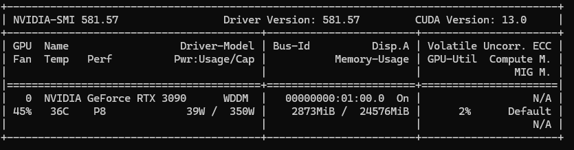
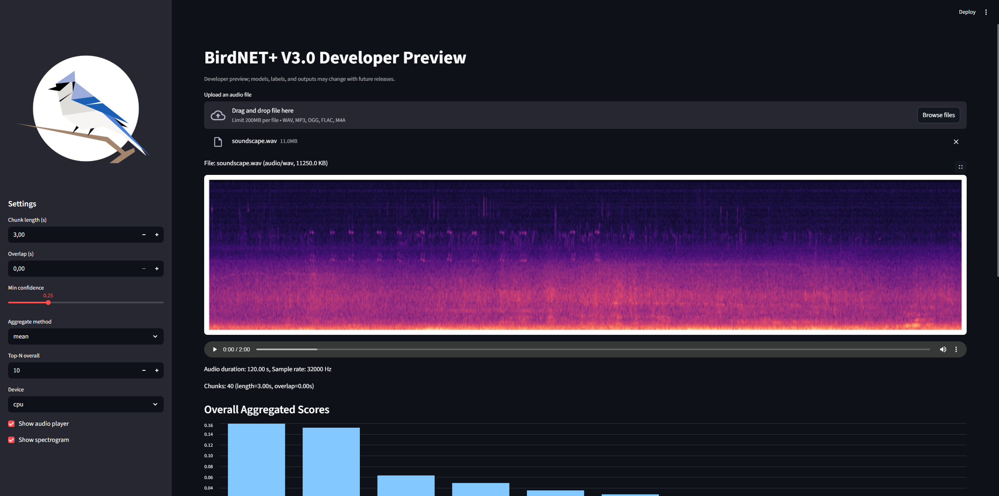

<div align="center"></div>

# birdnet-V3.0-dev + MIL Pooling Heads

CLI to analyze audio with BirdNET+ V3.0 developer preview models, export per-chunk detections, and train/evaluate Multiple Instance Learning (MIL) pooling heads for bioacoustic classification.

This repository provides tools for:
1. **BirdNET V3 analysis**: Run species detection on audio files
2. **Embedding extraction**: Export per-second embeddings to `.npz` files
3. **MIL training**: Train various pooling heads (LME, Attention, AutoPool, etc.) on embeddings
4. **Evaluation**: Pointing game metrics, attention visualization, deletion/insertion curves

We will release updated models, labels, and code as we finalize the V3.0 release.

**Key changes vs earlier model versions:**
- Variable-length input (removed fixed 3 s constraint)
- Model takes 32 kHz audio input (compared to 48 kHz previously)
- Improved architecture and training procedure
- Much larger and more diverse training dataset
- Expanded set of non-bird species

**Pending revisions:**
- Cross-platform / cross-framework packaging
- Species list curation (inclusion/exclusion based on data availability)
- Final architecture and model size
- Additional non-target / environmental classes (human, rain, wind, engines, etc.)

**Known issues:**
- no human voice detection yet
- the model struggles a bit with non-target sounds like rain, wind, engines (which it is not yet trained for)

### ⚠️ **Note:** This is a developer preview; models, labels, and code will change. Trained on a subset of data and may not reflect final performance.

## Install for Mac / Linux
```bash
python3 -m venv .venv
source .venv/bin/activate
pip install -r requirements.txt
```
## Install for Windows
```bash
python3 -m venv .venv
source .venv/Scripts/activate
pip install -r requirements.txt
```

### Optionally, on Windows, enable CUDA support
This option requires you have an NVIDIA GPU with CUDA installed and visible to the environment, check for this by typing:
```bash
nvidia-smi
```
You should see a table showing information about your CUDA version and running processes:


If you do, then you can install a CUDA-enabled version of pyTorch:

```bash
pip install -U torch torchvision torchaudio --index-url https://download.pytorch.org/whl/cu118
```


## Usage

Upon first run, the default model and labels will be automatically downloaded to the `models/` directory. You can download them manually from [Zenodo](https://zenodo.org/record/17571190).

Run the analysis with:

```bash
python analyze.py /path/to/audio.wav
```

### Options
- `--model` Path to model file (default: models/BirdNET+_V3.0-preview2_EUNA_1K_FP32.pt)
- `--labels` Path to labels CSV (default: models/BirdNET+_V3.0-preview2_EUNA_1K_Labels.csv)
- `--chunk_length` Chunk length in seconds (default: 3.0)
- `--overlap` Chunk overlap in seconds (default: 0.0)
- `--device` cpu|cuda (default: auto)
- `--min-conf` Minimum confidence threshold for exporting detections (default: 0.15)
- `--out-csv` Output CSV path (default: <audio>.results.csv)
- `--export-embeddings` Export per-chunk embeddings as additional column in results CSV

### Output
- Per-chunk CSV with columns: `name,start_sec,end_sec,confidence,label` and optionally `embeddings`
- One row per (chunk, label) with confidence ≥ `--min-conf`
- Multiple rows per chunk if multiple labels exceed threshold


## Examples
```bash
# Minimal (uses defaults where available)
python analyze.py example/soundscape.wav

# Specify model, chunk length, min confidence, and output CSV with embeddings
python analyze.py example/soundscape.wav --chunk_length 2.0 --min-conf 0.2 --out-csv results.csv --export-embeddings

# Specify model and run on CUDA-enabled GPU
python analyze.py example/soundscape.wav --model models/BirdNET+_V3.0-preview1_EUNA_1K_FP32.pt --device cuda
```

**Note:** The minimal model call will return embeddings and predictions for all chunks and needs to look like this:

```python
embeddings, predictions = model(input)
```

## Streamlit web app

For quick experimentation, we provide an interactive UI to upload audio, view a spectrogram, run the model, and visualize results.




### Start the app
```bash
# Activate your venv first if you use one
source .venv/bin/activate
# N.B. On Windows use:
source .venv/Scripts/activate

# Run Streamlit
streamlit run app.py

# Alternatively, to increase 200 MB files size limit to e.g. 2GB
streamlit run app.py --server.maxUploadSize 2048

```

- The app opens in your browser (usually http://localhost:8501).
- On first run, if you keep the default paths, the model and labels will be downloaded into models.

### Headless/server usage (Linux):
```bash
streamlit run app.py --server.address 0.0.0.0 --server.port 8501
# then open http://<server-ip>:8501 in your browser
```

### How to use
- Upload an audio file (wav, mp3, ogg, flac, m4a).
- Adjust settings in the sidebar:
  - Chunk length (s), Overlap (s)
  - Min confidence threshold
  - Device (cpu/cuda, if available)
- The app will:
  - Render a mel spectrogram of the audio
  - Show an overall bar chart of aggregated scores (top-N)
  - List per-chunk detections (sorted by score) with a Download CSV button

## License

- **Source Code**: The source code for this project is licensed under the [MIT License](https://opensource.org/licenses/MIT).
- **Models**: The models used in this project are licensed under the [Creative Commons Attribution-ShareAlike 4.0 International License (CC BY-SA 4.0)](https://creativecommons.org/licenses/by-sa/4.0/).

Please ensure you review and adhere to the specific license terms provided with each model.

## Terms of Use

Please refer to the [TERMS OF USE](TERMS_OF_USE.md) file for detailed terms and conditions regarding the use of the BirdNET+ V3.0 developer preview models.

## Citation

Lasseck, M., Eibl, M., Klinck, H., & Kahl, S. (2025). BirdNET+ V3.0 model developer preview (Preview 2). Zenodo. https://doi.org/10.5281/zenodo.17631020

```bibtex
@dataset{lasseck2025birdnet,
  title     = {BirdNET+ V3.0 model developer preview (Preview 2)},
  author    = {Lasseck, M. and Eibl, M. and Klinck, H. and Kahl, S.},
  year      = {2025},
  publisher = {Zenodo},
  doi       = {10.5281/zenodo.17631020},
  url       = {https://doi.org/10.5281/zenodo.17631020}
}
```

## Funding

Our work in the K. Lisa Yang Center for Conservation Bioacoustics is made possible by the generosity of K. Lisa Yang to advance innovative conservation technologies to inspire and inform the conservation of wildlife and habitats.

The development of BirdNET is supported by the German Federal Ministry of Research, Technology and Space (FKZ 01|S22072), the German Federal Ministry for the Environment, Climate Action, Nature Conservation and Nuclear Safety (FKZ 67KI31040E), the German Federal Ministry of Economic Affairs and Energy (FKZ 16KN095550), the Deutsche Bundesstiftung Umwelt (project 39263/01) and the European Social Fund.

## Partners

BirdNET is a joint effort of partners from academia and industry.
Without these partnerships, this project would not have been possible.
Thank you!


---

## MIL Pooling Heads

This repository includes a complete pipeline for training Multiple Instance Learning (MIL) pooling heads on BirdNET embeddings using strong labels from AnuraSet.

### Project Structure

```
bird-net_mil/
├── birdnetv3/               # BirdNET V3 embedding extraction
│   ├── model_loader.py      # Load TorchScript model
│   ├── utils_audio.py       # Audio loading/framing utilities
│   └── embed_all.py         # Batch embedding export
├── mil/                     # MIL training and evaluation
│   ├── heads.py             # Pooling heads (LME, Attention, AutoPool, etc.)
│   ├── datasets.py          # Dataset for embeddings + strong labels
│   ├── train.py             # Training loop with W&B integration
│   └── evaluate.py          # Pointing game, attention visualization
├── scripts/                 # CLI entry points
│   ├── export_embeddings.py # Export embeddings from audio
│   ├── train_mil.py         # Train MIL pooling heads
│   └── plot_attention.py    # Visualize attention weights
├── configs/                 # Configuration files
│   └── default.yaml         # Default training config
├── tests/                   # Unit tests
├── runs/                    # Output directory for results
└── pyproject.toml           # Project configuration
```

### Dataset Layout (AnuraSet)

The MIL pipeline expects data organized as follows:

```
/data/
├── anuraset/
│   ├── wavs/                 # Preprocessed 3-s clips by site
│   │   ├── SITE_A/
│   │   │   ├── REC_000001.wav
│   │   │   └── REC_000002.wav
│   │   └── SITE_B/...
│   ├── metadata.csv          # Class labels (multi-label)
│   └── strong_labels/        # Per-event annotations
│       ├── SITE_A/
│       │   ├── REC_000001.txt  # Lines: "<start_sec> <end_sec> <species> [quality]"
│       │   └── REC_000002.txt
│       └── SITE_B/...
└── embeddings/               # Output from embedding extraction
    ├── SITE_A/
    │   ├── REC_000001.embeddings.npz
    │   └── REC_000002.embeddings.npz
    └── SITE_B/...
```

### Available Pooling Heads

| Pooler | Description | Output | Loss |
|--------|-------------|--------|------|
| `mean` | Simple mean over time | Logits | BCEWithLogitsLoss |
| `max` | Max pooling over time | Logits | BCEWithLogitsLoss |
| `lme` | Log-mean-exp with learnable temperature | Logits | BCEWithLogitsLoss |
| `autopool` | Adaptive softmax pooling (McFee et al., 2018) | Probabilities | BCELoss |
| `attn` | Attention-based MIL (Ilse et al., 2018) | Probabilities | BCELoss |
| `linsoft` | Linear-softmax pooling (Wang & Metze, 2017) | Probabilities | BCELoss |
| `noisyor` | Noisy-OR pooling | Probabilities | BCELoss |

### Quick Start: MIL Training

```bash
# 1) Export embeddings for all WAVs (1-s chunks)
python scripts/export_embeddings.py \
    --wav_dir /data/anuraset/wavs \
    --out_dir /data/embeddings \
    --chunk_length 1.0 \
    --overlap 0.0

# 2) Train several poolers and log to W&B
python scripts/train_mil.py \
    --emb_dir /data/embeddings \
    --strong_root /data/anuraset/strong_labels \
    --poolers lme attn autopool linsoft noisyor mean max \
    --epochs 20 \
    --batch_size 32 \
    --out_dir ./runs \
    --wandb \
    --wandb_project bird-mil

# 3) Plot attention for a specific file & class
python scripts/plot_attention.py \
    --npz /data/embeddings/SITE_A/REC_000001.embeddings.npz \
    --checkpoint runs/attn_last.pt \
    --class "Boana faber" \
    --out runs/attention_REC_000001_Boana_faber.png \
    --wandb
```

### Install for MIL Development

```bash
# Create virtual environment
python3 -m venv .venv
source .venv/bin/activate

# Install with development dependencies
pip install -e ".[dev]"

# Or install with W&B support
pip install -e ".[wandb]"

# Or install everything
pip install -e ".[all]"
```

### Running Tests

```bash
# Run all tests
pytest tests/ -v

# Run specific test file
pytest tests/test_mil_heads.py -v

# Run with coverage
pytest tests/ --cov=mil --cov=birdnetv3
```

### Python API Example

```python
import torch
from mil.heads import PoolingHead

# Create a pooling head
head = PoolingHead(
    in_dim=1024,    # BirdNET embedding dimension
    n_classes=42,   # Number of species
    pool="attn"     # Attention-based pooling
)

# Forward pass
embeddings = torch.randn(4, 3, 1024)  # (batch, time, features)
y_clip, z_per_sec = head(embeddings)

print(f"Clip predictions: {y_clip.shape}")      # (4, 42)
print(f"Per-second logits: {z_per_sec.shape}")  # (4, 3, 42)

# Get attention weights for visualization
attention = head.get_attention_weights(embeddings)  # (4, 3, 42)
```

### W&B Integration

When running with `--wandb`, the training script will log:
- Per-epoch loss curves
- Final loss plots as images
- Model checkpoints
- Training configuration


### Adding New Pooling Heads

To add a custom pooler:

1. Create a new class in `mil/heads.py`:
```python
class MyCustomPool(nn.Module):
    def forward(self, z: torch.Tensor) -> torch.Tensor:
        # z: (B, T, C) logits
        # Return: (B, C) pooled output
        ...
```

2. Add to `POOLER_NAMES` list
3. If it returns probabilities, add to `PROB_SPACE_POOLERS`
4. Handle initialization in `PoolingHead.__init__`

---
